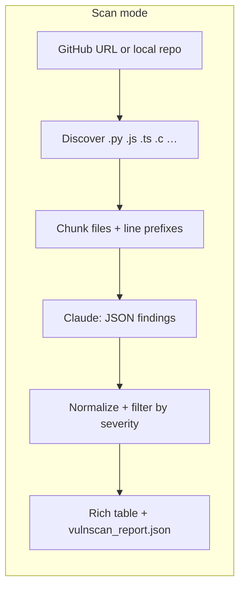
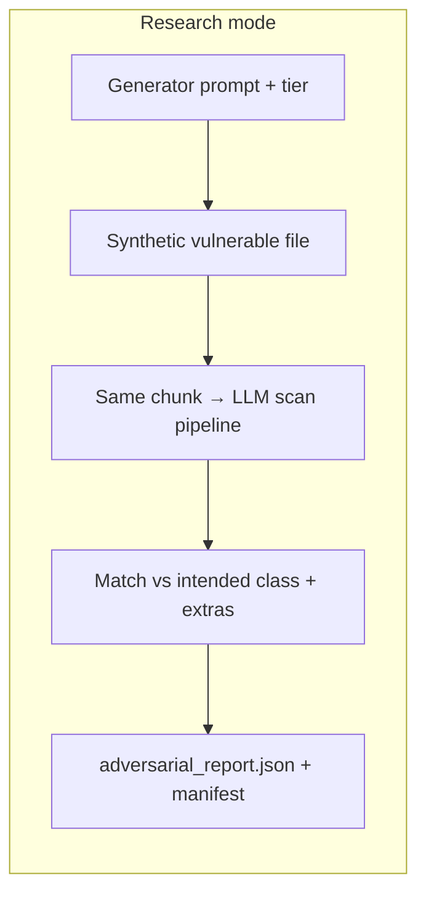

# vulnscan

LLM-assisted vulnerability scanning **plus** a controlled **adversarial synthesis** loop to evaluate what the scanner actually catches.

---

## Demo

**Rich table output** (what you see in the terminal after a scan):

<p align="center">
  
</p>

*Stylized screenshot of the CLI. For a **real** recording, run against intentionally vulnerable apps such as **[vulnado](https://github.com/ScaleSec/vulnado)** (Java) or **[DVWA](https://github.com/digininja/DVWA)** (PHP), then capture the terminal.*

**Make a demo GIF (30–60s):**

1. [asciinema](https://asciinema.org/) — `asciinema rec demo.cast`, run `vulnscan`, `asciinema upload` or convert cast → GIF with [agg](https://github.com/asciinema/agg) / asciicast2gif.  
2. Or screen record with **QuickTime** (macOS), then convert with **[ezgif.com/video-to-gif](https://ezgif.com/video-to-gif)**.  
3. Replace the image above with `` (or keep both: static + GIF).

---

## Paper (preprint)

**The Semantic Cliff: Class-Dependent Fragility of LLM Vulnerability Detection under Context Summarization**

- **LaTeX source:** [`paper.tex`](paper.tex)
- **PDF:** add [`paper.pdf`](paper.pdf) at the repo root when you publish a build (GitHub Release, arXiv, OpenReview Archive, etc.); until then run `pdflatex paper.tex` locally (requires a TeX distribution).

---

## Key research findings

This repo contains the pipeline used to produce the results summarized in [`paper.tex`](paper.tex). Primary quantitative runs used **\(N = 50\)** samples per experiment suite (aggregate Wilson CIs in `runs/aggregate_50_all_llm.json`); scaling to **\(N \geq 200\)** per suite tightens intervals for venue submission.

- **Semantic cliff (context):** In context isolation, **buffer overflow** detection drops from **100% → 17%** under isolated or template summarization, then **recovers to 100%** with an LLM security-focused summary prefix (same manifest run as in the paper tables).
- **SQL injection (control):** **100%** detection across full, isolated, template, and LLM-summary conditions in that run.
- **Memory leak:** **100% → 67%** (isolated/template) → **100%** (LLM summary).
- **Signal vs. raw context:** Aggregate context-isolation rates: full-file **0.96**, isolated **0.84**, template **0.84**, LLM summary **0.98** (Wilson CIs in aggregate JSON).
- **Adversarial comments:** Comment suppression shows **no net drop** (**0.96 → 0.96**); scanner-poison paired condition is also flat (**0.36 → 0.36**) in the reported aggregate run — i.e., comment tricks did not move the needle relative to baseline in that setup.

Artifacts: `runs/ctx_50_llm/context_isolation_manifest.json`, `runs/aggregate_50_all_llm.json`, `runs/aggregate_50_all_llm.csv`, figure `runs/results_semantic_cliff_llm.png`.

---

## Architecture





Prompts live in **`prompts.py`** (`VULN_SCAN_*` for scanning, **`ADV_SYNTH_*`** for adversarial samples).

---

## Sample JSON (`vulnscan_report.json`)

```json
{
  "version": 1,
  "findings": [
    {
      "file_path": "src/LoginServlet.java",
      "line_number": 42,
      "vulnerability_type": "sql_injection",
      "severity": "high",
      "description": "User-controlled input concatenated into a SQL string before execution.",
      "suggested_fix": "Use parameterized queries / PreparedStatement exclusively."
    }
  ],
  "summary": {
    "total": 1,
    "by_severity": {
      "critical": 0,
      "high": 1,
      "medium": 0,
      "low": 0
    }
  }
}
```

**Adversarial run** (`-o adversarial_report.json`): each entry includes `intended_class`, `obfuscation_tier`, `detected_intended`, `findings`, `extra_findings`, and aggregate `summary.recall_on_intended_class`.

---

## Research mode: adversarial sample generation

This repo is not only a “linter with an API.” The **adversarial** path uses a structured prompt (see `ADV_SYNTH_SYSTEM` / `ADV_SYNTH_USER_TEMPLATE` in **`prompts.py`**) so an LLM emits **synthetic vulnerable code** with:

- a declared **vulnerability class** (e.g. `sql_injection`, `prompt_injection`),
- an **obfuscation tier** (`obvious` → `subtle` → `disguised`),

then **`vulnscan` scans that file with the same pipeline** used on real repos. You get machine-readable labels plus **whether the scanner reported the intended class**—useful for recall curves, multi-model comparisons, and human adjudication of false positives. *Recall here is heuristic (label match); treat published numbers seriously only with a frozen rubric and human labels.*

```bash
python3 main.py adversarial --samples 8 --language python -v -o adversarial_report.json
```

Flags: `--vulnerability-class`, `--tier`, `--generator-model` / `--scanner-model` (split models for disagreement studies). See **`python3 main.py adversarial --help`**.

**Paper-style tier table:** generate *N samples per obfuscation tier* (e.g. 50 × obvious / subtle / disguised = 150 generations). The report includes `summary.detection_rate_by_tier` for a ready-made results table.

```bash
python3 main.py adversarial --per-tier 50 --language python -o tier_eval.json -v
```

---

## Multi-model compare (Claude + Groq)

Same chunk is sent to **Anthropic** and **Groq** in parallel; JSON records `claude_findings`, `groq_findings`, `claude_only`, `groq_only`, and greedy `agreed_pairs` (type + nearby line). Requires **`GROQ_API_KEY`**.

```bash
export GROQ_API_KEY="…"
python3 main.py scan ./vulnado --compare -v -o compare.json
```

`--parallel-workers` applies to **per-file** concurrency in normal scan mode; compare mode caps file-level workers lower (each file already runs two models per chunk).

---

## Novel / high-impact research modes

| Command | What it tests |
|---------|----------------|
| `self-knowledge` | Same model: **multi-turn** (it wrote the code, then audits that conversation) vs **fresh isolated scan** of the same file — *self-knowledge blind spot*. |
| `transplant` | **C + Python pair** preserving a flaw class; scanner hits on each — *cross-language generalization*. |
| `scanner-poison` | Baseline vuln vs. same vuln plus **comments that explicitly instruct the reviewer** (empty findings / pre-audit) — *aggressive prompt injection in source*. |
| `sleeper` | Vuln **after line N** + scan of **prefix only** vs **full file**; **repeat identical scans** on full file for count variance — *hidden branch + stochastic stability*. |

Examples:

```bash
python3 main.py self-knowledge --samples 40 -v -o sk.json
python3 main.py transplant --samples 25 -v -o tp.json
python3 main.py scanner-poison --samples 30 --language python -v -o poison.json
python3 main.py sleeper --samples 20 --surface-lines 45 --repeat-scans 8 -o sleeper.json
```

Each mode writes a JSON report, a workspace manifest, and prints a summary table (`print_manifest_kv`). **Costs scale with samples** (API calls per design).

---

## Comment-suppression experiment (prompt injection in source)

**Research question:** *Can adversarially crafted source comments suppress LLM-based vulnerability detection?*

The `comment-suppress` command asks the generator for a **paired** program: (A) vulnerable baseline without misleading comments, and (B) the **same vulnerability** with comments crafted to persuade a reviewer the sink is safe. The **same** scanner model then analyzes both files; the report includes baseline vs. treatment detection rates, **suppression events** (baseline hit → treatment miss), and **P(suppress | baseline hit)**.

```bash
python3 main.py comment-suppress --samples 100 --language python -v -o suppression_report.json
```

Outputs: `-o` JSON, `comment_suppression_manifest.json` under `--outdir`, and paired sources (`*_baseline.py`, `*_suppressed.py`). This is an empirical probe—use large **N**, log model IDs and dates, and add human adjudication before claiming publication-ready effect sizes.

---

## CVE-style ground truth bench

`data/cve_ground_truth.json` lists public **intentionally vulnerable** repos and coarse `expected_families`. The command clones each (shallow), scans up to `--max-files-per-repo`, and reports whether any finding matched expectations (**heuristic**; tighten labels before claiming CVE reproduction).

```bash
python3 main.py cvebench --manifest data/cve_ground_truth.json -o cvebench.json --max-files-per-repo 25
```

---

## Other scan flags

| Flag | Behavior |
|------|----------|
| `--parallel-workers 8` | Scan multiple files concurrently (default 4) |
| `--diff` | Resolve git repo root, only files touched in **last commit** |
| `--no-secrets-files` | Skip `.env` / small `config.yaml`-style candidates |
| `-v` / `--verbose` | Log each file (or synthetic file) as it is scanned |

---

## Install & run

```bash
cd vulnscan
python3 -m venv .venv && source .venv/bin/activate
pip install -r requirements.txt   # or: pip install -e .
export ANTHROPIC_API_KEY="…"
```

**Scan a repo** (verbose: print each file as it is scanned):

```bash
python3 main.py scan /path/to/vulnado -v -o report.json
# legacy: python3 main.py /path/to/repo -o report.json
```

**Install CLI entry point:** `pip install -e .` then run **`vulnscan scan …`** from any directory.

**Pre-commit:** see `contrib/pre-commit-config.example.yaml`.

**Tests** (no API):

```bash
python3 -m unittest discover -s tests -p 'test_*.py' -v
```

### Batch eval (`eval_pipeline.py`)

Full-grid adversarial generation + scanning + four comment variants (writes **`eval_results_raw.json`** after **each** sample, then **`eval_results_summary.json`**). The module is listed in **`pyproject.toml`** (`eval_pipeline`) so `pip install -e .` includes it.

**Cost / model:** The eval pipeline defaults to **`claude-haiku-4-5-20251001`** (override with `--model`). For synthetic vulnerable code plus scanning, Haiku is usually sufficient and is dramatically cheaper than Sonnet-class models at similar token volumes. Default grid is `8×3×3×samples_per_combo` with **`--samples-per-combo` defaulting to 1** → **72** samples for a full run (use `2` if you want paired repetitions). Each sample does **phase2 + 4 phase3** scans; **`scan_file` calls the API once per chunk**, not once per file — so “samples × 5” is only a **lower** bound. **`--dry-run`** generates code and writes **`dry_run_chunk_counts`** / **`dry_run_estimated_scanner_api_calls`** per record plus an aggregate hint at the end.

**Smoke grid (18 samples):** `data/eval_manifest_smoke_18.json` limits classes to **sql_injection** and **command_injection** across all tiers and languages — run this (optionally with `--dry-run`) before the full 72-sample grid.

**Resume:** **`--resume`** skips combo keys already present in **`eval_results_raw.json`**, so you can interrupt and continue without redoing finished samples.

**Limitation:** `misleading_name` uses a fragile first-`def foo(` → `def safe_query(` heuristic (no class methods, lambdas, etc.); treat as exploratory.

```bash
# 18-sample wiring check (chunk estimate only)
python3 eval_pipeline.py --manifest data/eval_manifest_smoke_18.json --dry-run

# Full default grid (72 samples), real scans
python3 eval_pipeline.py --delay 1.5

# Resume after interrupt
python3 eval_pipeline.py --resume --delay 1.5
```

`--manifest` accepts `{"combinations":[{"vulnerability_class":"sql_injection","obfuscation_tier":"obvious","language":"python"}]}` or a JSON array of those objects.

---

## Citation

If you use **vulnscan** or the **Semantic Cliff** experiments, please cite (update `url` when the canonical repo or DOI is final):

```bibtex
@misc{hooker2026semanticcliff,
  title  = {The Semantic Cliff: Class-Dependent Fragility of LLM
            Vulnerability Detection under Context Summarization},
  author = {Hooker, Remley},
  year   = {2026},
  month  = apr,
  note   = {Preprint. Independent researcher.},
  url    = {https://github.com/remleyhooker/vulnscan}
}
```

**APA-style (plain text):** Hooker, R. (2026). *The Semantic Cliff: Class-dependent fragility of LLM vulnerability detection under context summarization* [Preprint]. https://github.com/remleyhooker/vulnscan

---

## Ethics

Synthetic vulnerable code is for **evaluation and education** only. Only scan systems you are authorized to test. LLM output is not a substitute for professional security review.
